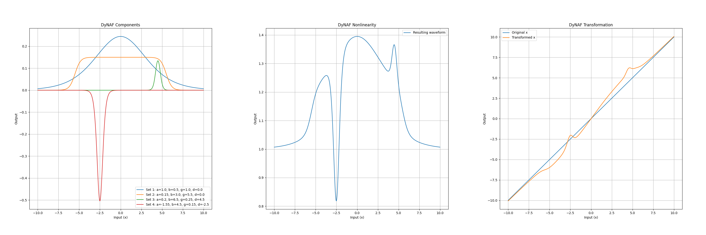

# Dynamic Neural Activation Functions (DyNAF)

The `DyNAF` module introduces a novel approach to neural network activation functions by incorporating dynamic, data-driven non-linearities, similar in spirit to Fourier series. This method allows the activation function to adapt its behavior based on the data flowing through the network, providing a tailored non-linear transformation for each input.

## Overview

Traditional activation functions, such as ReLU or sigmoid, apply a fixed transformation to their inputs. While these functions have proven effective in many contexts, they can sometimes limit a model's capacity to capture complex patterns and relationships within the data.

`DyNAF` addresses this limitation by introducing a parameterized "wave" function that adjusts its shape based on a set of control parameters. These parameters are dynamically generated by an external module, referred to as the Theta-network, which can be designed and optimized separately from the main network.

## Function Description

The core of `DyNAF` is a function that applies a series of sigmoid-based transformations, each with its own set of control parameters:

$$f(x) = x \left(1 + \sum_{i=1}^{n} \alpha_i \left( \frac{1}{1 + e^{|\beta_i| (x - \delta_i - |\gamma_i|)}} - \frac{1}{1 + e^{|\beta_i| (x - \delta_i + |\gamma_i|)}} \right) \right)$$

Here, each transformation is defined by a quad of parameters ($\alpha_i$, $\beta_i$, $\gamma_i$, $\delta_i$), which control the amplitude, steepness, width, and a center shift of the "bell" shape, respectively. The sum of these transformations, when added to 1, modulates the original input `x`, allowing for complex, point-specific non-linearities.

The whole process can be visually represented by the following three plots:

1. **DyNAF Components**: The first plot displays four distinct DyNAF waves, each corresponding to a different set of parameters ($\alpha_i$, $\beta_i$, $\gamma_i$, $\delta_i$). These waves represent individual activation functions with unique characteristics:
   - The blue wave (Set 1) has a standard bell shape, centered around zero.
   - The orange wave (Set 2) is wider, indicating a broader range of influence.
   - The green wave (Set 3) is narrower and taller, suggesting a more localized but stronger activation.
   - The red wave (Set 4) is an inverse bell, representing a suppressive effect in its region.
2. **DyNAF Nonlinearity**: The second plot illustrates the resulting waveform derived from the sum of the initial four DyNAF waves plus one. This represents the multiplicative term that will be applied to the input data, showcasing the composite effect of combining multiple DyNAF components. The waveform varies significantly across the input range, indicating a rich, data-driven nonlinearity.
3. **DyNAF Transformation**: The third plot demonstrates the final transformation applied to the input data. It compares the original input `x` (blue line) with the transformed output (orange line), which is the product of the input and the multiplicative term. This plot highlights the regions where the input is amplified, suppressed, or left unchanged, depicting the targeted, complex nonlinearity introduced by the DyNAF process.

Together, these plots elucidate the mechanism by which DyNAF applies a dynamic, data-driven transformation to the input data, adjusting the neural network's activation in a flexible and context-dependent (when combined with a Theta network) manner.

## Impact on Exploding/Vanishing Gradients

One of the significant challenges in training deep neural networks is the problem of exploding or vanishing gradients. As the gradient of the loss is propagated back through layers, it can either grow exponentially (explode) or shrink to insignificance (vanish), leading to unstable or ineffective training.

The `DyNAF` module, in conjunction with the Theta-network, is designed to mitigate these issues through its dynamic, data-driven approach to activation functions:

- **Smooth Gradients**: The underlying sigmoidal components of the DyNAF function produce smooth gradients. Because sigmoids have a bounded derivative, the gradients are less likely to reach extremely high or low values. This inherent property can contribute to more stable training, especially in deep networks.

- **Selective Activation**: The multiplicative nature of the DyNAF function, where the output is the input scaled by the sum of transformations plus one, ensures that regions of the input space that do not require transformation can pass through with their gradients unchanged. This selective activation helps in maintaining a healthy gradient flow, reducing the risk of vanishing gradients.

- **Data-Driven Modulation**: Since the parameters generated by the Theta-network are data-dependent, the activation function can adapt to the specifics of the data at hand. This adaptability means that the network can learn to avoid regions of the parameter space that might cause gradient issues, a form of learned robustness against these problems.

### Preventive Measures in Design

While the design of DyNAF aims to reduce the likelihood of exploding or vanishing gradients, it is still essential to implement preventive measures in the network's training regimen:

- **Careful Initialization**: The parameters of both DyNAF (when it operates in the passive mode) or the Theta-network should be initialized to values that start the training process with gradients of a reasonable magnitude.
  
- **Gradient Clipping**: During training, gradient clipping can be employed to prevent the gradients from exceeding a certain threshold, thus avoiding the exploding gradients problem.

By incorporating these design elements and training strategies, DyNAF seeks to provide a more stable training experience, particularly for deep and complex neural network architectures where the exploding or vanishing gradients problem is most prevalent.

## Modes of Operation

`DyNAF` can operate in two modes:

1. **Passive Mode**: The parameters for the transformations are learned directly as part of the main network's training process. This mode is useful for scenarios where simplicity and ease of integration are priorities.

2. **Active Mode**: The control parameters are supplied externally, typically by a Theta-network. This mode allows for more sophisticated and context-dependent behaviors, as the Theta-network can condition the generation of parameters on the input data or other signals.

## Integration with Theta-network

The Theta-network is a separate neural network module designed to generate the control parameters for `DyNAF`. The architecture of the Theta-network can vary based on the complexity of the task and the desired level of adaptability.

- In passive mode, the Theta-network is essentially integrated into the `DyNAF` function as a set of trainable parameters.
- In active mode, the Theta-network is an independent model that can be trained separately or in conjunction with the main network.

## Usage

`DyNAF` is designed to be flexible and easy to integrate into existing machine learning pipelines. It can be used as a direct replacement for traditional activation functions, with additional capabilities enabled by the Theta-network for more advanced applications.

## Future Directions

The `DyNAF` module is an ongoing project with the goal of pushing the boundaries of neural network adaptability and performance. Future updates may include optimizations for computational efficiency, enhanced training algorithms, and expanded integration options.

## Contributing
Contributions and suggestions are welcome! Feel free to fork the repository, open issues, and submit pull requests.

## License

`DyNAF` is released under the MIT License. See the `LICENSE` file for more details.
