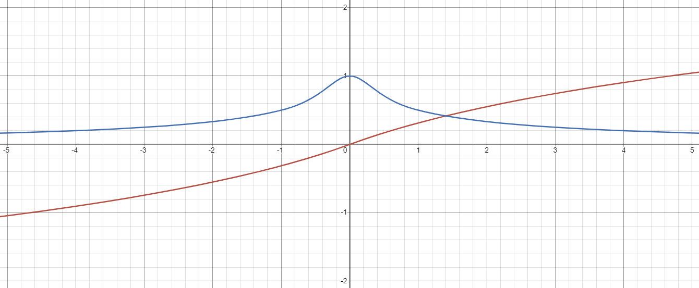
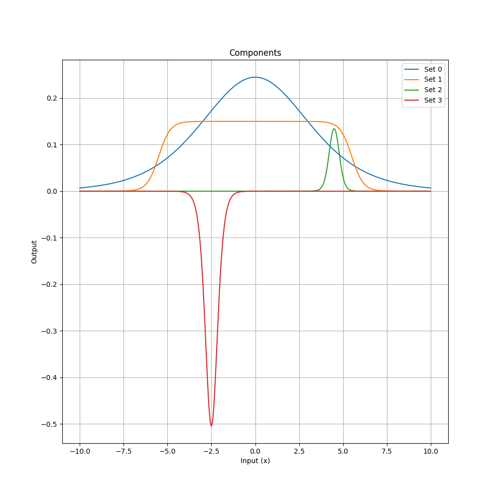
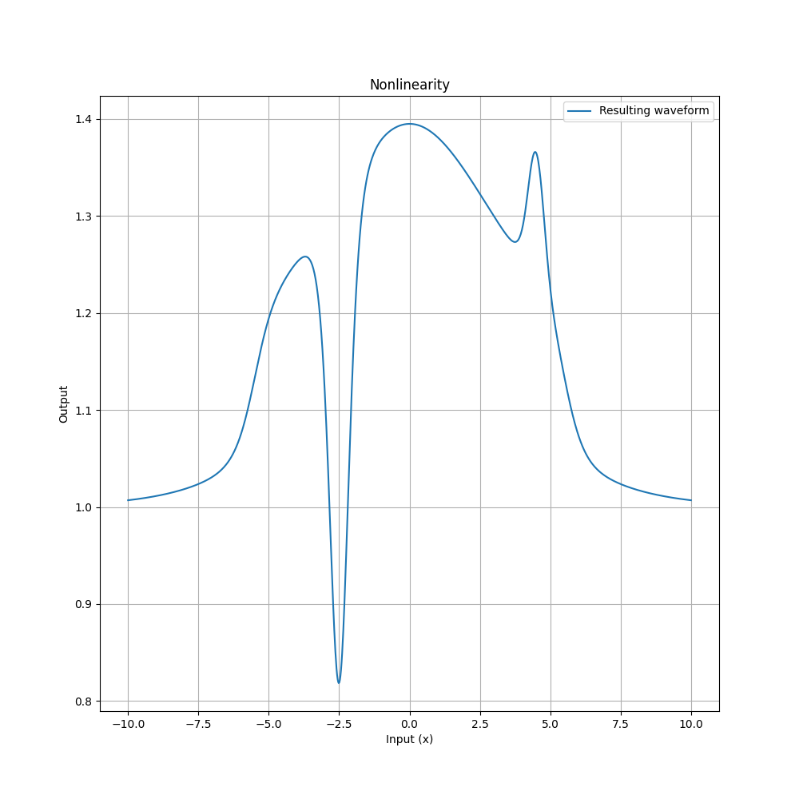
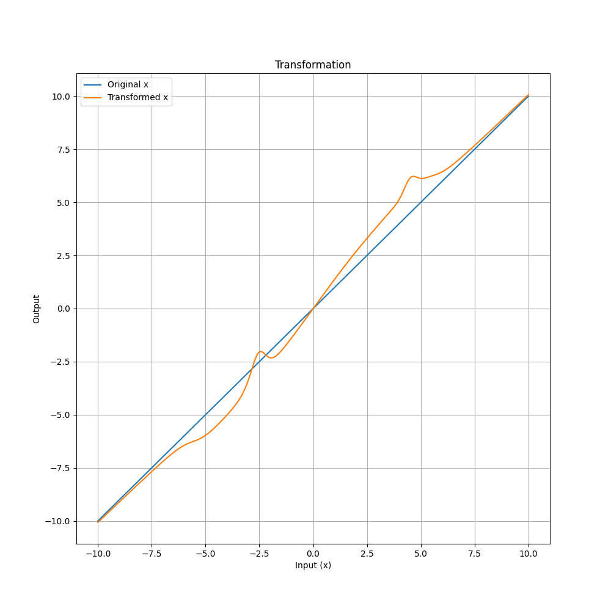
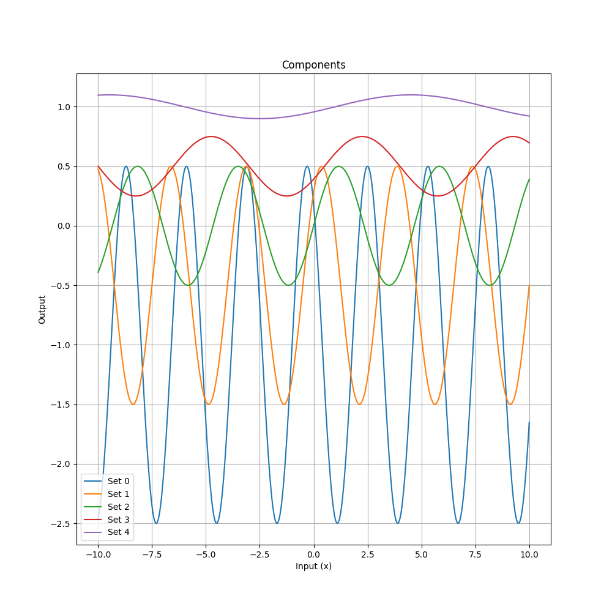
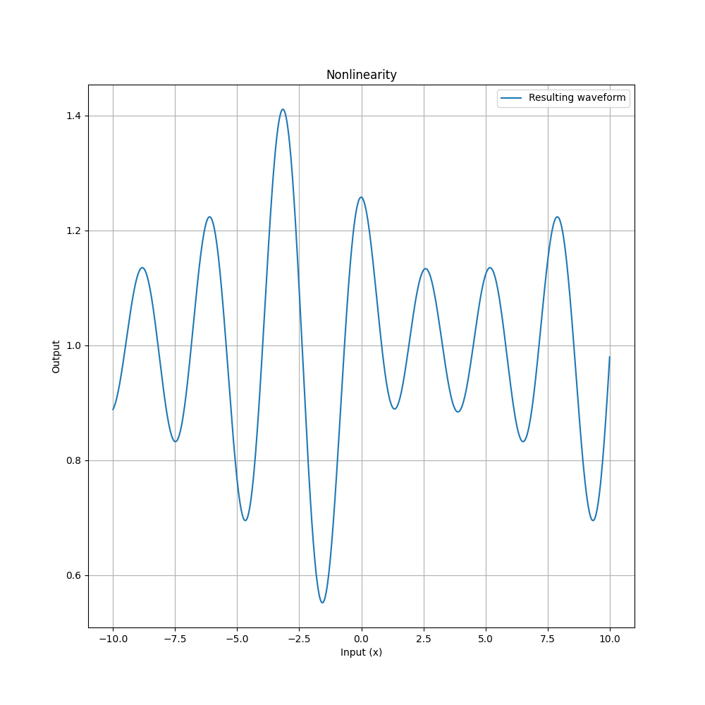
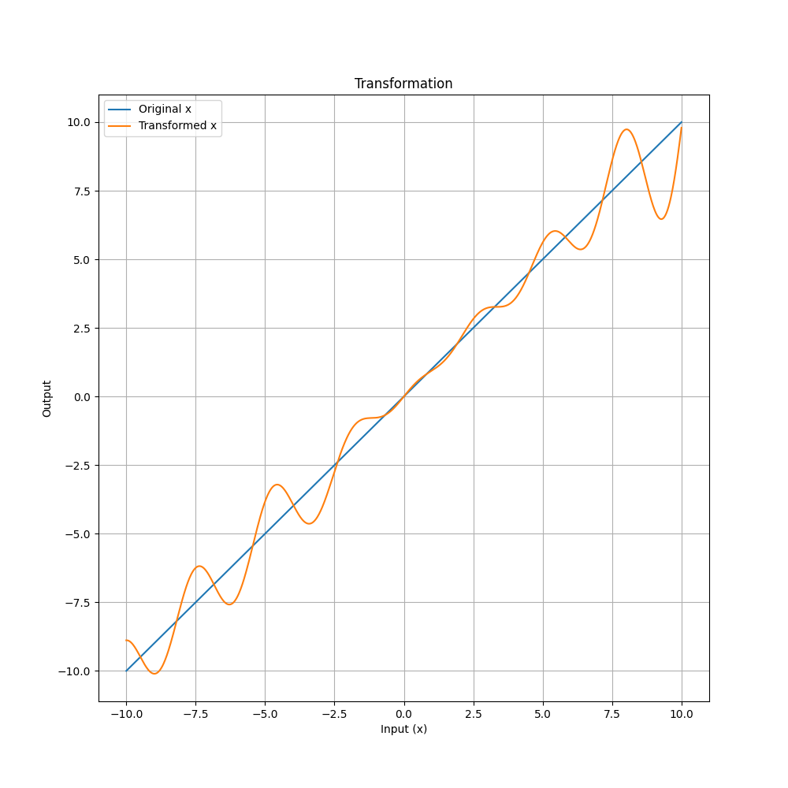

**Important note**

This repository contains work-in-progress state of my ongoing research and implementation of biologically inspired signal propagation framework `DyNA`.

**What is this repository about and what is it for?**

I see some fundamental problems in the conventional approaches to work with complex sequential data and this project is my attempt to workaround some of such problems.

Key feature of the DyNA approach and the main principle could be described as follows:
> _Any transformation (linear or nonlinear) applied to the data should be derived from the data semantics itself._

**Fronts of research and development:**
- Dynamic weight matrices. 
  - **Done:** 
    - dyna/weights_lib_2d.py: main concept.
    - dyna/exponential_warper_1d.py: deriving of weights coefficients.
- Dynamic activations. 
  - **Partially done:** 
    - dyna/modulated_activation_bell.py: "bell"-shaped activation.
    - dyna/modulated_activation_sine.py: sinusoidal, Fourier-series like activation.
- Dynamic routing. 
  - **Work in progress**

---

**Table of contents:**

- [Dynamic Neural Architecture (DyNA)](#dynamic-neural-architecture-dyna)
  - [Key Concepts](#key-concepts)
    - [Transform-Modulate-Propagate](#transform-modulate-propagate)
  - [Math Background: SigLog - Sigmoid Logarithmic](#math-background-siglog---sigmoid-logarithmic)
  - [Math Background: Bell Activation](#math-background-bell-activation)
    - [Components](#components)
    - [Nonlinearity](#nonlinearity)
    - [Transformation](#transformation)
  - [Math Background: Sine Activation](#math-background-sine-activation)
  - [Math Background: Theta Linear](#math-background-theta-linear)
  - [Contributing](#contributing)
  - [License](#license)

---

# Dynamic Neural Architecture (DyNA)

The `DyNA` project extends beyond traditional neural network paradigms by embracing a comprehensive framework of dynamic, adaptive mechanisms rooted in the intricate behaviors observed in biological neural systems. This framework transcends conventional activation function models, introducing a rich tapestry of data-driven, context-sensitive processes that enable neural elements within the architecture to modulate their behavior in response to evolving inputs and environmental cues. This adaptive capability ensures that each component within the network can offer a customized response, dynamically shaping its output to optimally align with the specific demands of the input, thereby embodying a more naturalistic and flexible approach to neural computation.

## Key Concepts

### Transform-Modulate-Propagate

Below is a diagram for Transform-Modulate-Propagate cycle (TMP-cycle for short). This diagram shows the main steps of signal processing, conceptual components and their interaction in the `DyNA` framework.

## Math Background: SigLog - Sigmoid Logarithmic

SigLog is a sigmoid-like function based on natural logarithm: [siglog.py](dyna/siglog.py)

Function definition:
$$f(x) = \left( \ln \left( |x| + e + \epsilon \right)-1.0 \right) \cdot \left\{\begin{array}{ll}-1.0 & x < 0.0\\+1.0 & x\geq 0.0\end{array}\right.$$
Where $e$ is the Euler's constant and $\epsilon$ is a small value, introduced to avoid zero values in the output.

Approximated derivative:
$$f'(x) \approx \frac{1}{|x|^{1 + \{|x|<1.0:x\rightarrow 1-\sqrt{x \bmod 1.0}, x\rightarrow 0.0 \}}+1.0}$$

__Pros:__
   - Wide range of output values: $\lim_{x\to-\infty}=-\infty$ and $\lim_{x\to+\infty}=+\infty$, since function's logarithmic nature.
   - Meaningful gradients over a wide range of output values, even when used with low precision training, leads to better propagation of gradients and partially eliminates the problem of their vanishing.
   - Efficient and meaningful compression of large values limits the problem of gradient explosion to some extent.
   - Zero-centered symmetry.

__Cons:__
   - Lower dynamics of output values in comparison with other sigmoid-like functions (tanh, conventional sigmoid etc.).
   - Relatively computationally intensive in both forward and backward passes.
   - Not exact derivative.

## Math Background: Bell Activation

The `DyNA` "bell" activation is a function that applies a series of sigmoid-based transformations, each with its own set of control parameters:

$$f(x) = x \left(1 + \sum_{i=1}^{n} \alpha_i \left( \frac{1}{1 + e^{|\beta_i| (x - \delta_i - |\gamma_i|)}} - \frac{1}{1 + e^{|\beta_i| (x - \delta_i + |\gamma_i|)}} \right) \right)$$

Here, each transformation is defined by a quad of parameters ($\alpha_i$, $\beta_i$, $\gamma_i$, $\delta_i$), which control the amplitude, steepness, width, and a center shift of the "bell" shape, respectively. The sum of these transformations, when added to 1, modulates the original input `x`, allowing for complex, point-specific non-linearities.

The whole process can be visually represented by three plots (one per step): Components, Nonlinearity and Transformation.

### Components

The first plot displays four distinct `DyNA` waves, each corresponding to a different set of parameters ($\alpha_i$, $\beta_i$, $\gamma_i$, $\delta_i$). These waves represent individual activation functions with unique characteristics:
   - The blue wave (Set 1) has a standard bell shape, centered around zero.
   - The orange wave (Set 2) is wider, indicating a broader range of influence.
   - The green wave (Set 3) is narrower and taller, suggesting a more localized but stronger activation.
   - The red wave (Set 4) is an inverse bell, representing a suppressive effect in its region.

### Nonlinearity

The second plot illustrates the resulting waveform derived from the sum of the initial four `DyNA` waves plus one. This represents the multiplicative term that will be applied to the input data, showcasing the composite effect of combining multiple `DyNA` components. The waveform varies significantly across the input range, indicating a rich, data-driven nonlinearity.

### Transformation

The third plot demonstrates the final transformation applied to the input data. It compares the original input `x` (blue line) with the transformed output (orange line), which is the product of the input and the multiplicative term. This plot highlights the regions where the input is amplified, suppressed, or left unchanged, depicting the targeted, complex nonlinearity introduced by the `DyNA` process.

Together, these plots elucidate the mechanism by which `DyNA` applies a dynamic, data-driven transformation to the input data, adjusting the neural network's activation in a flexible and context-dependent (when combined with a Theta network) manner.

## Math Background: Sine Activation

TODO: Add description.

## Math Background: Theta Linear

TODO: Add description.

## Contributing
Contributions and suggestions are welcome! Feel free to fork the repository, open issues, and submit pull requests.

## License

`DyNA` is released under the MIT License. See the `LICENSE` file for more details.
