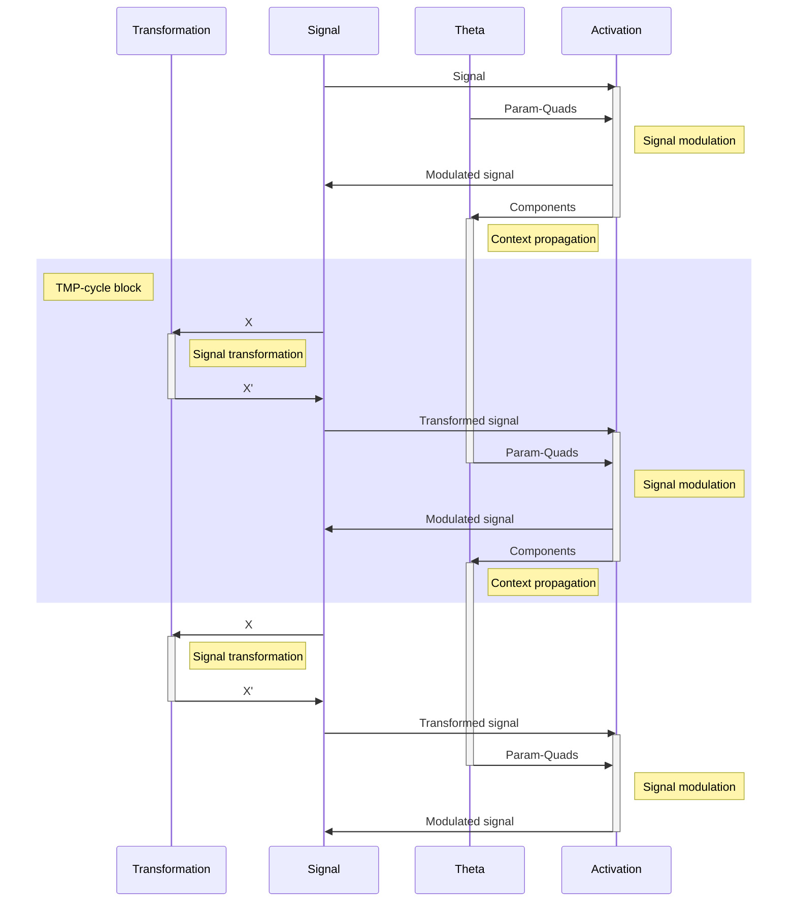
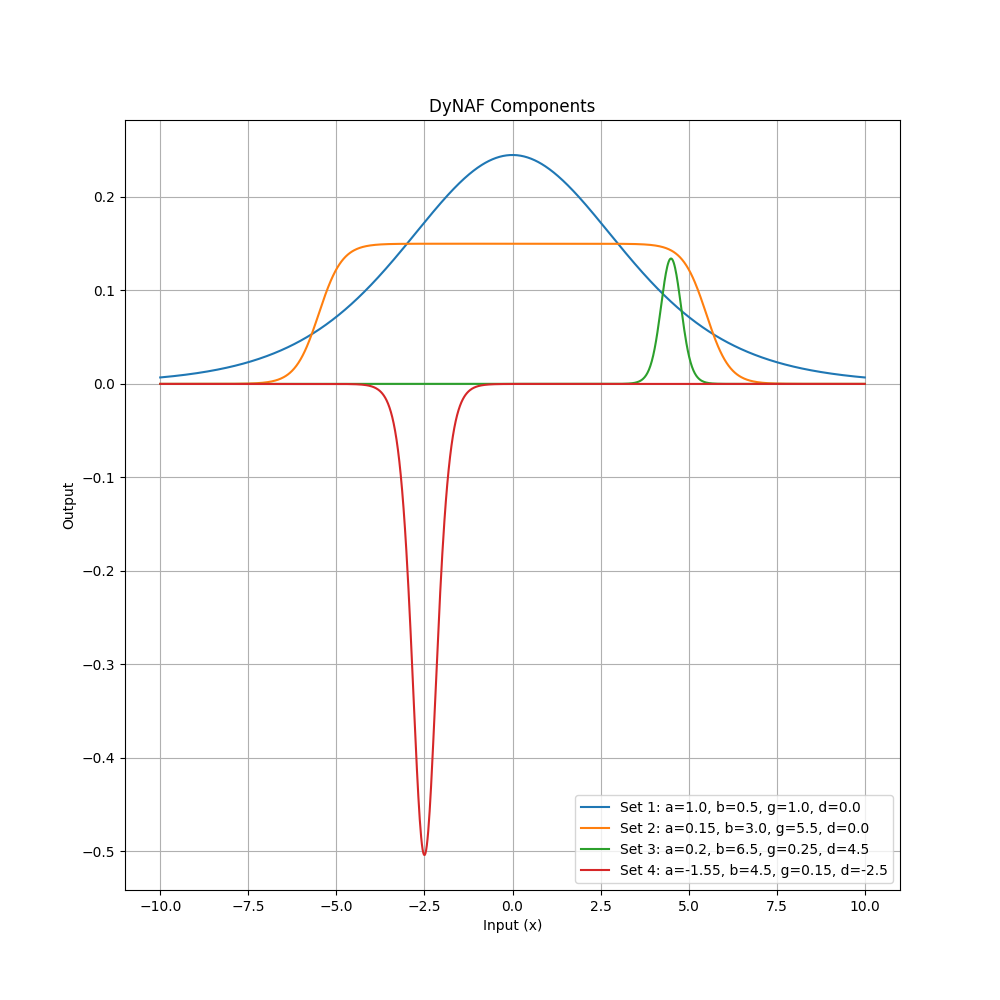
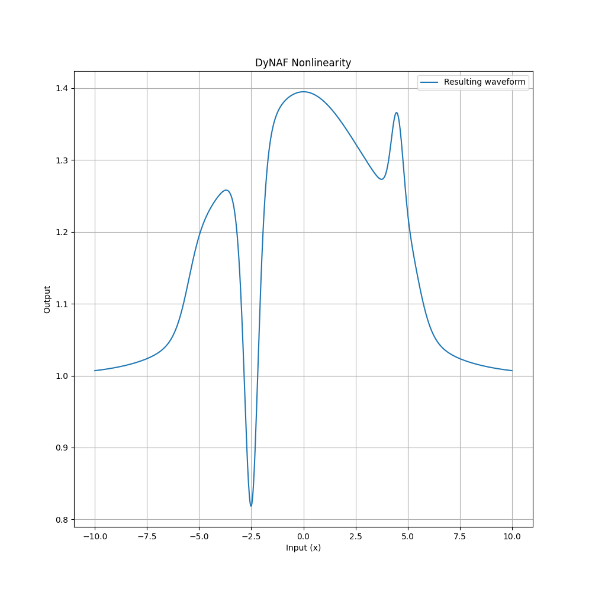
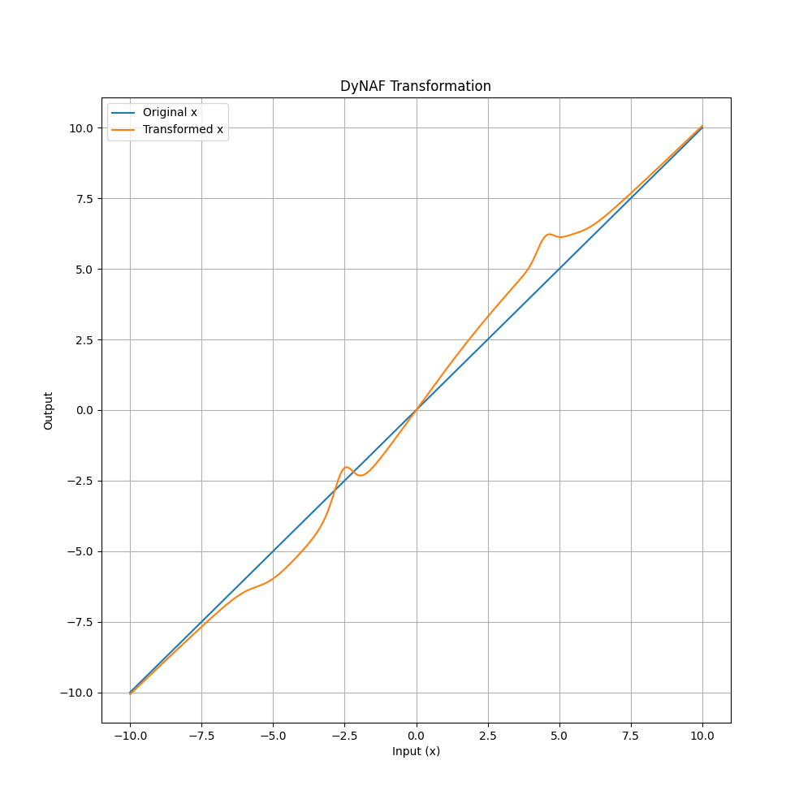

**Important note**

This repository contains work-in-progress state of my ongoing research and implementation of biologically inspired signal propagation framework `DyNA`.

---

**Table of contents:**

- [Dynamic Neural Architecture (DyNA)](#dynamic-neural-architecture-dyna)
  - [Overview](#overview)
  - [Key Concepts](#key-concepts)
    - [DyNA Activation](#dyna-activation)
    - [Theta-network](#theta-network)
    - [DyNA Components](#dyna-components)
    - [Neuromodulatory Profile and Its Propagation](#neuromodulatory-profile-and-its-propagation)
    - [Interconnections](#interconnections)
    - [Transform-Modulate-Propagate](#transform-modulate-propagate)
  - [DyNA Activation's Mathematical Background](#dyna-activations-mathematical-background)
    - [Components](#components)
    - [Nonlinearity](#nonlinearity)
    - [Transformation](#transformation)
    - [Impact on Exploding/Vanishing Gradients](#impact-on-explodingvanishing-gradients)
      - [Preventive Measures in Design](#preventive-measures-in-design)
    - [Modes of Operation](#modes-of-operation)
    - [Integration with Theta-network](#integration-with-theta-network)
  - [DyNA: Linear Modulation Factory (Theta-network)](#dyna-linear-modulation-factory-theta-network)
  - [Usage](#usage)
  - [Future Directions](#future-directions)
  - [Contributing](#contributing)
  - [License](#license)

---

# Dynamic Neural Architecture (DyNA)

The `DyNA` project extends beyond traditional neural network paradigms by embracing a comprehensive framework of dynamic, adaptive mechanisms rooted in the intricate behaviors observed in biological neural systems. This framework transcends conventional activation function models, introducing a rich tapestry of data-driven, context-sensitive processes that enable neural elements within the architecture to modulate their behavior in response to evolving inputs and environmental cues. This adaptive capability ensures that each component within the network can offer a customized response, dynamically shaping its output to optimally align with the specific demands of the input, thereby embodying a more naturalistic and flexible approach to neural computation.

## Overview

Traditional activation functions, including ReLU and sigmoid, provide a consistent and predictable response to inputs within neural networks, contributing to the success of various applications in machine learning. However, the inherent static nature of these functions may limit the ability of networks to process and adapt to complex data patterns effectively.

`DyNA` addresses these limitations by integrating principles observed in biological neural systems, specifically the adaptive responses of neurons to changing environmental inputs. This is achieved through the implementation of a dynamic framework where the characteristics of the activation function can be adjusted in real-time based on a set of parameters that are generated dynamically. This approach is inspired by the biological mechanism of synaptic modulation, where the presence of different neuromodulators can alter the strength and efficacy of synaptic connections, thereby allowing for a flexible and context-dependent response to incoming signals.

Central to the DyNA framework is the Theta-network, a component designed to generate the dynamic parameters that modulate the activation function. This allows for the activation response to be continuously tailored to the current data, enhancing the network's ability to discern and adapt to complex patterns and relationships within the data.

By incorporating these dynamic and adaptive mechanisms, DyNA aims to extend the capabilities of neural networks beyond the constraints of fixed activation functions, drawing closer to the adaptive and context-sensitive processing observed in biological neural systems. This approach seeks to enhance the interpretability and performance of neural networks, particularly in tasks that benefit from a more nuanced understanding of data.

## Key Concepts

### DyNA Activation

The `DyNA` Activation function represents the cornerstone of the `DyNA` framework, introducing a dynamic, data-driven mechanism for neuron activation. Unlike traditional static activation functions, `DyNA` Activation is characterized by its adaptability; it modulates its behavior in response to both the input it receives and a set of external parameters known as param-quads. This adaptability allows for a tailored, context-sensitive response to inputs, enhancing the network's ability to model complex data patterns and relationships.

### Theta-network

The Theta-network is an ancillary neural network module responsible for generating the param-quads that guide the `DyNA` Activation function. Acting as a "neuromodulator factory," the Theta-network synthesizes these parameters based on the current state and inputs of the network, effectively determining the modulation and adaptation of the `DyNA` Activation function.

### DyNA Components

DyNA Components refer to the individual elements or "waves" that constitute the overall `DyNA` Activation function. Each component is shaped by a specific set of param-quads, allowing for a composite activation function that is the sum of these individual modulated responses. The `DyNA` Components encapsulate the nuanced influence of the neuromodulatory profile on neuron activation, providing a granular view of how the activation function adapts and responds to inputs.

### Neuromodulatory Profile and Its Propagation

The neuromodulatory profile in the `DyNA` framework mirrors the concept of neuromodulation in biological neural systems, where various factors dynamically influence neuron activity. In DyNA, this profile is represented by the param-quads generated by the Theta-network and applied through the `DyNA` Activation. The propagation of this neuromodulatory profile from layer to layer is a key feature of the `DyNA` framework, allowing the adaptive behavior initiated by one layer's Theta-network to inform and shape the responses in subsequent layers. This layer-wise propagation ensures that the network's adaptive mechanisms are cumulative and coherent, leading to a deeply integrated and contextually aware model.

### Interconnections

The interconnections among these concepts are pivotal to the `DyNA` framework's functionality:

- The **Theta-network** generates the **neuromodulatory profile** (param-quads) that directs the **DyNA Activation** function.
- The **DyNA Activation** function, through its **components**, applies this profile to dynamically modulate the neuron's response to inputs.
- The **components** of the `DyNA` Activation function, influenced by the current neuromodulatory profile, serve as the basis for generating the neuromodulatory profile for subsequent layers, enabling the **propagation** of adaptive behavior throughout the network.

This cohesive integration of dynamic activation, neuromodulatory influence, and layer-wise propagation underpins the `DyNA` framework's ability to mimic the complex, adaptive processes observed in biological neural systems, offering a pathway toward more intelligent and contextually responsive neural network models.

### Transform-Modulate-Propagate

Below is a diagram for Transform-Modulate-Propagate cycle (TMP-cycle for short). This diagram shows the main steps of signal processing, conceptual components and their interaction in the `DyNA` framework.

## DyNA Activation's Mathematical Background

The core of `DyNA` is a function that applies a series of sigmoid-based transformations, each with its own set of control parameters:

$$f(x) = x \left(1 + \sum_{i=1}^{n} \alpha_i \left( \frac{1}{1 + e^{|\beta_i| (x - \delta_i - |\gamma_i|)}} - \frac{1}{1 + e^{|\beta_i| (x - \delta_i + |\gamma_i|)}} \right) \right)$$

Here, each transformation is defined by a quad of parameters ($\alpha_i$, $\beta_i$, $\gamma_i$, $\delta_i$), which control the amplitude, steepness, width, and a center shift of the "bell" shape, respectively. The sum of these transformations, when added to 1, modulates the original input `x`, allowing for complex, point-specific non-linearities.

The whole process can be visually represented by three plots (one per step): Components, Nonlinearity and Transformation.

### Components

The first plot displays four distinct `DyNA` waves, each corresponding to a different set of parameters ($\alpha_i$, $\beta_i$, $\gamma_i$, $\delta_i$). These waves represent individual activation functions with unique characteristics:
   - The blue wave (Set 1) has a standard bell shape, centered around zero.
   - The orange wave (Set 2) is wider, indicating a broader range of influence.
   - The green wave (Set 3) is narrower and taller, suggesting a more localized but stronger activation.
   - The red wave (Set 4) is an inverse bell, representing a suppressive effect in its region.

### Nonlinearity

The second plot illustrates the resulting waveform derived from the sum of the initial four `DyNA` waves plus one. This represents the multiplicative term that will be applied to the input data, showcasing the composite effect of combining multiple `DyNA` components. The waveform varies significantly across the input range, indicating a rich, data-driven nonlinearity.

### Transformation

The third plot demonstrates the final transformation applied to the input data. It compares the original input `x` (blue line) with the transformed output (orange line), which is the product of the input and the multiplicative term. This plot highlights the regions where the input is amplified, suppressed, or left unchanged, depicting the targeted, complex nonlinearity introduced by the `DyNA` process.

Together, these plots elucidate the mechanism by which `DyNA` applies a dynamic, data-driven transformation to the input data, adjusting the neural network's activation in a flexible and context-dependent (when combined with a Theta network) manner.

### Impact on Exploding/Vanishing Gradients

One of the significant challenges in training deep neural networks is the problem of exploding or vanishing gradients. As the gradient of the loss is propagated back through layers, it can either grow exponentially (explode) or shrink to insignificance (vanish), leading to unstable or ineffective training.

The `DyNA` module, in conjunction with the Theta-network, is designed to mitigate these issues through its dynamic, data-driven approach to activation functions:

- **Smooth Gradients**: The underlying sigmoidal components of the `DyNA` function produce smooth gradients. Because sigmoids have a bounded derivative, the gradients are less likely to reach extremely high or low values. This inherent property can contribute to more stable training, especially in deep networks.

- **Selective Activation**: The multiplicative nature of the `DyNA` function, where the output is the input scaled by the sum of transformations plus one, ensures that regions of the input space that do not require transformation can pass through with their gradients unchanged. This selective activation helps in maintaining a healthy gradient flow, reducing the risk of vanishing gradients.

- **Data-Driven Modulation**: Since the parameters generated by the Theta-network are data-dependent, the activation function can adapt to the specifics of the data at hand. This adaptability means that the network can learn to avoid regions of the parameter space that might cause gradient issues, a form of learned robustness against these problems.

#### Preventive Measures in Design

While the design of `DyNA` aims to reduce the likelihood of exploding or vanishing gradients, it is still essential to implement preventive measures in the network's training regimen:

- **Careful Initialization**: The parameters of both `DyNA` (when it operates in the passive mode) or the Theta-network should be initialized to values that start the training process with gradients of a reasonable magnitude.
  
- **Gradient Clipping**: During training, gradient clipping can be employed to prevent the gradients from exceeding a certain threshold, thus avoiding the exploding gradients problem.

By incorporating these design elements and training strategies, `DyNA` seeks to provide a more stable training experience, particularly for deep and complex neural network architectures where the exploding or vanishing gradients problem is most prevalent.

### Modes of Operation

`DyNA` can operate in two modes:

1. **Passive Mode**: The parameters for the transformations are learned directly as part of the main network's training process. This mode is useful for scenarios where simplicity and ease of integration are priorities.

2. **Active Mode**: The control parameters are supplied externally, typically by a Theta-network. This mode allows for more sophisticated and context-dependent behaviors, as the Theta-network can condition the generation of parameters on the input data or other signals.

### Integration with Theta-network

The Theta-network is a separate neural network module designed to generate the control parameters for `DyNA`. The architecture of the Theta-network can vary based on the complexity of the task and the desired level of adaptability.

- In passive mode, the Theta-network is essentially integrated into the `DyNA` function as a set of trainable parameters.
- In active mode, the Theta-network is an independent model that can be trained separately or in conjunction with the main network.

## DyNA: Linear Modulation Factory (Theta-network)

__WIP__

## Usage

`DyNA` is designed to be flexible and easy to integrate into existing machine learning pipelines. It can be used as a direct replacement for traditional activation functions, with additional capabilities enabled by the Theta-network for more advanced applications.

## Future Directions

The `DyNA` module is an ongoing project with the goal of pushing the boundaries of neural network adaptability and performance. Future updates may include optimizations for computational efficiency, enhanced training algorithms, and expanded integration options.

## Contributing
Contributions and suggestions are welcome! Feel free to fork the repository, open issues, and submit pull requests.

## License

`DyNA` is released under the MIT License. See the `LICENSE` file for more details.
