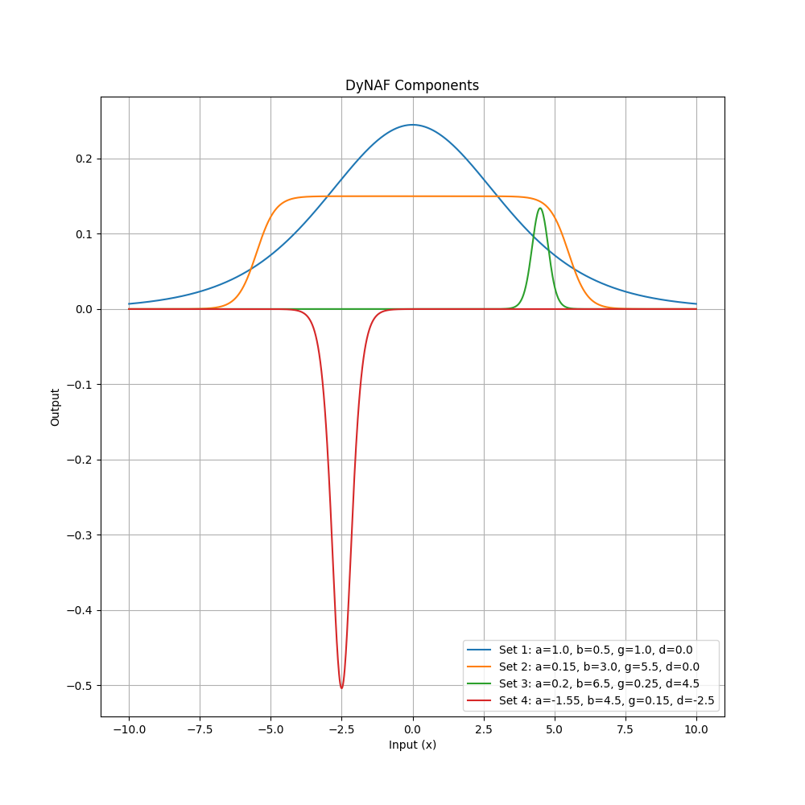
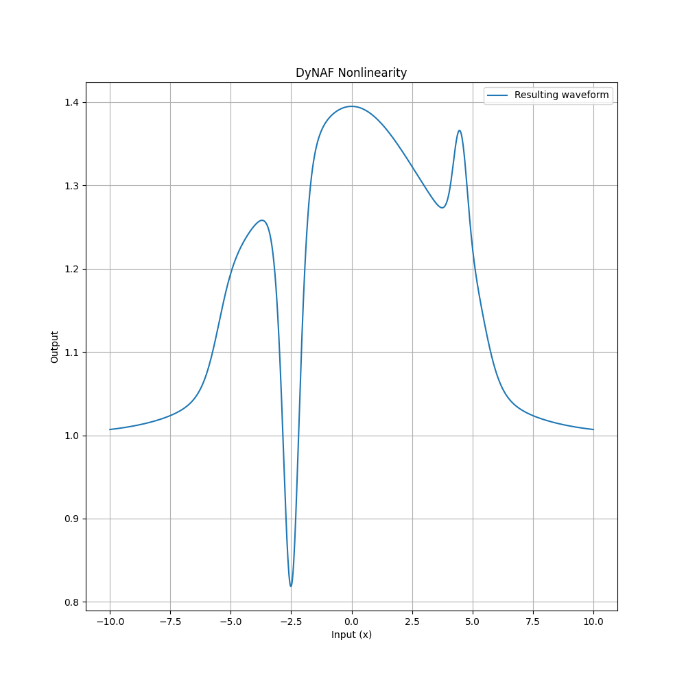
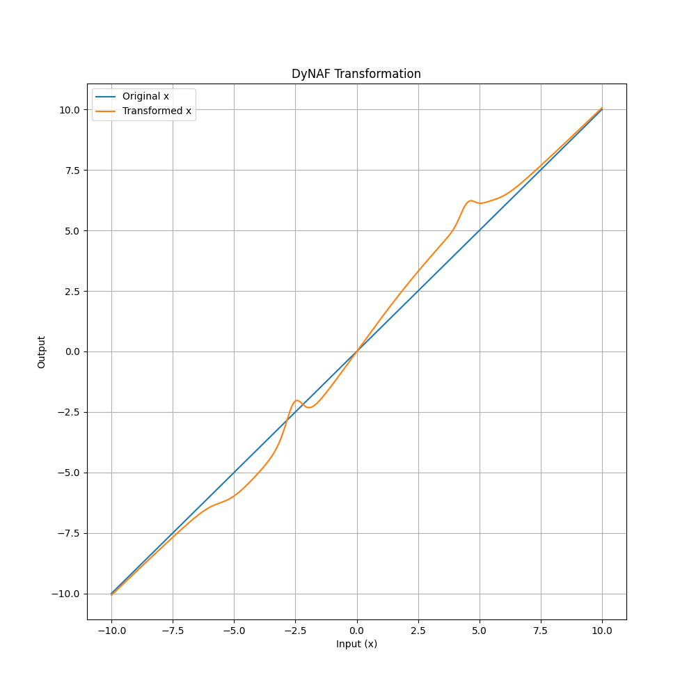

- [Dynamic Neural Activation Functions (DyNAF)](#dynamic-neural-activation-functions-dynaf)
  - [Overview](#overview)
    - [Framework Breakdown](#framework-breakdown)
  - [DyNAF: Activation Function](#dynaf-activation-function)
    - [Components](#components)
    - [Nonlinearity](#nonlinearity)
    - [Transformation](#transformation)
    - [Impact on Exploding/Vanishing Gradients](#impact-on-explodingvanishing-gradients)
      - [Preventive Measures in Design](#preventive-measures-in-design)
    - [Modes of Operation](#modes-of-operation)
    - [Integration with Theta-network](#integration-with-theta-network)
  - [DyNAF: Linear Modulation Factory (Theta-network)](#dynaf-linear-modulation-factory-theta-network)
  - [Usage](#usage)
  - [Future Directions](#future-directions)
  - [Contributing](#contributing)
  - [License](#license)

# Dynamic Neural Activation Functions (DyNAF)

The `DyNAF` framework extends neural network activation functions by introducing dynamic, adaptable non-linearities inspired by the complexity of biological neural systems. This approach enables the activation function to dynamically adjust its response based on the input data, facilitating a customized non-linear transformation for every input instance.

## Overview

Conventional activation functions like ReLU or sigmoid offer consistent, unchanging transformations of their inputs. Effective across numerous applications, these static functions may not fully capture the intricate patterns and relationships present in complex datasets.

`DyNAF` transcends these constraints by employing a biologically inspired "wave" function, whose characteristics are modulated by a set of dynamically generated parameters. This design mirrors the adaptability observed in biological neurons, where synaptic efficacy is modulated by a variety of neurotransmitters, allowing for a highly flexible response to incoming signals. The parameters governing this modulation are produced by an ancillary model, the Theta-network, which can be independently tailored and refined to suit the overarching network architecture.

By emulating the nuanced regulatory mechanisms of biological neurons, `DyNAF` offers a more versatile and context-sensitive approach to neural computation, promising enhancements in the network's ability to discern and adapt to the nuanced features of the data it processes.

### Framework Breakdown

The `DyNAF` framework consists of two primary components, each drawing inspiration from the complex mechanisms of biological neurons:

1. **DyNAF Activation Function**: At the core of `DyNAF` is a dynamic activation function, characterized by its ability to adapt its shape and response based on external parameters. This adaptability is akin to the way biological neurons alter their activation thresholds and response curves in the presence of different concentrations and types of neurotransmitters. The `DyNAF` function employs a set of parameters, akin to a 'neurotransmitter profile,' which modulates the activation response to more accurately reflect the underlying data patterns.

2. **DyNAF Linear Layer Modification**: To generate the 'neurotransmitter profile' for each neuron within the network, the `DyNAF` framework introduces a modification to the traditional linear layer. This modified layer, in addition to computing the standard linear transformation of its inputs, also produces a set of dynamic parameters for each output feature. These parameters are then utilized by the `DyNAF` activation function, mirroring the biological process where the local environment and history of synaptic activity influence a neuron's response to stimuli.

The interaction between these two components is crucial: the modified linear layer, acting as a 'neuromodulator factory,' tailors the activation landscape for each neuron, allowing for an unprecedented level of adaptability and specificity in the network's processing capabilities.

By integrating these components, `DyNAF` not only enhances the model's capacity to learn complex and nuanced data representations but also opens new avenues for research into more biologically faithful artificial neural networks.

## DyNAF: Activation Function

The core of `DyNAF` is a function that applies a series of sigmoid-based transformations, each with its own set of control parameters:

$$f(x) = x \left(1 + \sum_{i=1}^{n} \alpha_i \left( \frac{1}{1 + e^{|\beta_i| (x - \delta_i - |\gamma_i|)}} - \frac{1}{1 + e^{|\beta_i| (x - \delta_i + |\gamma_i|)}} \right) \right)$$

Here, each transformation is defined by a quad of parameters ($\alpha_i$, $\beta_i$, $\gamma_i$, $\delta_i$), which control the amplitude, steepness, width, and a center shift of the "bell" shape, respectively. The sum of these transformations, when added to 1, modulates the original input `x`, allowing for complex, point-specific non-linearities.

The whole process can be visually represented by three plots (one per step): Components, Nonlinearity and Transformation.

### Components

The first plot displays four distinct `DyNAF` waves, each corresponding to a different set of parameters ($\alpha_i$, $\beta_i$, $\gamma_i$, $\delta_i$). These waves represent individual activation functions with unique characteristics:
   - The blue wave (Set 1) has a standard bell shape, centered around zero.
   - The orange wave (Set 2) is wider, indicating a broader range of influence.
   - The green wave (Set 3) is narrower and taller, suggesting a more localized but stronger activation.
   - The red wave (Set 4) is an inverse bell, representing a suppressive effect in its region.

### Nonlinearity

The second plot illustrates the resulting waveform derived from the sum of the initial four `DyNAF` waves plus one. This represents the multiplicative term that will be applied to the input data, showcasing the composite effect of combining multiple `DyNAF` components. The waveform varies significantly across the input range, indicating a rich, data-driven nonlinearity.

### Transformation

The third plot demonstrates the final transformation applied to the input data. It compares the original input `x` (blue line) with the transformed output (orange line), which is the product of the input and the multiplicative term. This plot highlights the regions where the input is amplified, suppressed, or left unchanged, depicting the targeted, complex nonlinearity introduced by the `DyNAF` process.

Together, these plots elucidate the mechanism by which `DyNAF` applies a dynamic, data-driven transformation to the input data, adjusting the neural network's activation in a flexible and context-dependent (when combined with a Theta network) manner.

### Impact on Exploding/Vanishing Gradients

One of the significant challenges in training deep neural networks is the problem of exploding or vanishing gradients. As the gradient of the loss is propagated back through layers, it can either grow exponentially (explode) or shrink to insignificance (vanish), leading to unstable or ineffective training.

The `DyNAF` module, in conjunction with the Theta-network, is designed to mitigate these issues through its dynamic, data-driven approach to activation functions:

- **Smooth Gradients**: The underlying sigmoidal components of the `DyNAF` function produce smooth gradients. Because sigmoids have a bounded derivative, the gradients are less likely to reach extremely high or low values. This inherent property can contribute to more stable training, especially in deep networks.

- **Selective Activation**: The multiplicative nature of the `DyNAF` function, where the output is the input scaled by the sum of transformations plus one, ensures that regions of the input space that do not require transformation can pass through with their gradients unchanged. This selective activation helps in maintaining a healthy gradient flow, reducing the risk of vanishing gradients.

- **Data-Driven Modulation**: Since the parameters generated by the Theta-network are data-dependent, the activation function can adapt to the specifics of the data at hand. This adaptability means that the network can learn to avoid regions of the parameter space that might cause gradient issues, a form of learned robustness against these problems.

#### Preventive Measures in Design

While the design of `DyNAF` aims to reduce the likelihood of exploding or vanishing gradients, it is still essential to implement preventive measures in the network's training regimen:

- **Careful Initialization**: The parameters of both `DyNAF` (when it operates in the passive mode) or the Theta-network should be initialized to values that start the training process with gradients of a reasonable magnitude.
  
- **Gradient Clipping**: During training, gradient clipping can be employed to prevent the gradients from exceeding a certain threshold, thus avoiding the exploding gradients problem.

By incorporating these design elements and training strategies, `DyNAF` seeks to provide a more stable training experience, particularly for deep and complex neural network architectures where the exploding or vanishing gradients problem is most prevalent.

### Modes of Operation

`DyNAF` can operate in two modes:

1. **Passive Mode**: The parameters for the transformations are learned directly as part of the main network's training process. This mode is useful for scenarios where simplicity and ease of integration are priorities.

2. **Active Mode**: The control parameters are supplied externally, typically by a Theta-network. This mode allows for more sophisticated and context-dependent behaviors, as the Theta-network can condition the generation of parameters on the input data or other signals.

### Integration with Theta-network

The Theta-network is a separate neural network module designed to generate the control parameters for `DyNAF`. The architecture of the Theta-network can vary based on the complexity of the task and the desired level of adaptability.

- In passive mode, the Theta-network is essentially integrated into the `DyNAF` function as a set of trainable parameters.
- In active mode, the Theta-network is an independent model that can be trained separately or in conjunction with the main network.

## DyNAF: Linear Modulation Factory (Theta-network)

__WIP__

## Usage

`DyNAF` is designed to be flexible and easy to integrate into existing machine learning pipelines. It can be used as a direct replacement for traditional activation functions, with additional capabilities enabled by the Theta-network for more advanced applications.

## Future Directions

The `DyNAF` module is an ongoing project with the goal of pushing the boundaries of neural network adaptability and performance. Future updates may include optimizations for computational efficiency, enhanced training algorithms, and expanded integration options.

## Contributing
Contributions and suggestions are welcome! Feel free to fork the repository, open issues, and submit pull requests.

## License

`DyNAF` is released under the MIT License. See the `LICENSE` file for more details.
