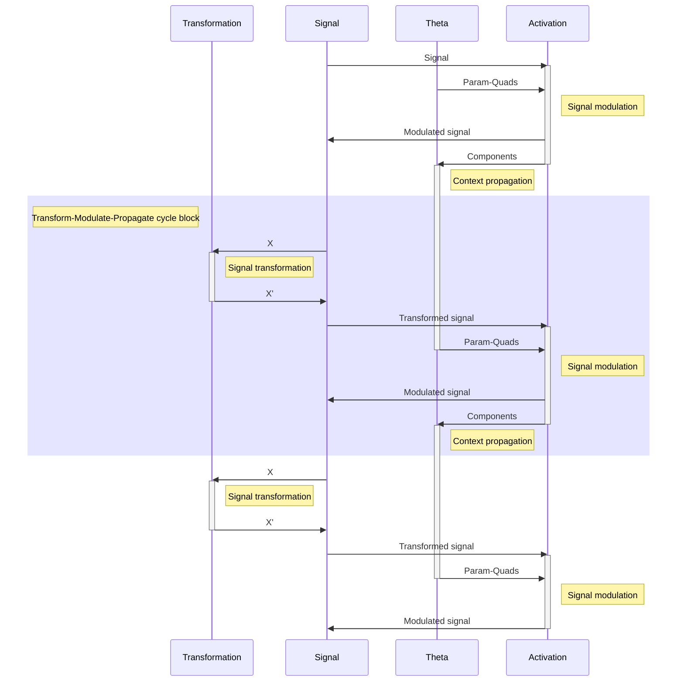

**Important note**

This repository contains work-in-progress state of my ongoing research and implementation of biologically inspired signal propagation framework `DyNAF`.

---

**Table of contents:**

- [Dynamic Neural Activation Functions (DyNAF)](#dynamic-neural-activation-functions-dynaf)
  - [Overview](#overview)
  - [Key Concepts](#key-concepts)
    - [DyNAF Activation](#dynaf-activation)
    - [Theta-network](#theta-network)
    - [DyNAF Components](#dynaf-components)
    - [Neuromodulatory Profile and Its Propagation](#neuromodulatory-profile-and-its-propagation)
    - [Interconnections](#interconnections)
    - [Transform-Modulate-Propagate cycle](#transform-modulate-propagate-cycle)
  - [DyNAF Activation's Mathematical Background](#dynaf-activations-mathematical-background)
    - [Components](#components)
    - [Nonlinearity](#nonlinearity)
    - [Transformation](#transformation)
    - [Impact on Exploding/Vanishing Gradients](#impact-on-explodingvanishing-gradients)
      - [Preventive Measures in Design](#preventive-measures-in-design)
    - [Modes of Operation](#modes-of-operation)
    - [Integration with Theta-network](#integration-with-theta-network)
  - [DyNAF: Linear Modulation Factory (Theta-network)](#dynaf-linear-modulation-factory-theta-network)
  - [Usage](#usage)
  - [Future Directions](#future-directions)
  - [Contributing](#contributing)
  - [License](#license)

---

# Dynamic Neural Activation Functions (DyNAF)

The `DyNAF` initiative refines the concept of activation functions within neural networks by introducing a system of dynamic, data-responsive non-linearities that draw inspiration from the nuanced operations of biological neural systems. This innovative approach allows for an activation function that can adjust its response in real-time to the incoming data, providing a bespoke non-linear transformation tailored to each specific input.

## Overview

Traditional activation functions such as ReLU and sigmoid are characterized by their fixed, uniform response to inputs. While these functions are broadly effective and have been instrumental in numerous neural network applications, their static nature may limit the network's capacity to fully interpret and utilize complex data patterns and relationships.

`DyNAF` surpasses these limitations by adopting a "wave" function inspired by biological principles, which can modify its behavior based on a dynamically generated set of parameters. This capability reflects the biological phenomenon observed in neurons, where the effectiveness of synaptic transmission is influenced by various neuromodulators, resulting in a highly adaptive and flexible response to stimuli. The generation of these modulatory parameters is handled by a specialized module known as the Theta-network, which can be customized and optimized separately from the main network to align with specific architectural needs.

In mirroring the sophisticated regulatory functions observed in biological neurons, `DyNAF` introduces a level of versatility and sensitivity to context within neural network computation that holds the promise of significantly enhancing the network's proficiency in identifying and responding to complex data characteristics. This approach not only broadens the scope of neural network capabilities but also paves the way for more biologically realistic models of neural computation.

## Key Concepts

### DyNAF Activation

The `DyNAF` Activation function represents the cornerstone of the `DyNAF` framework, introducing a dynamic, data-driven mechanism for neuron activation. Unlike traditional static activation functions, `DyNAF` Activation is characterized by its adaptability; it modulates its behavior in response to both the input it receives and a set of external parameters known as param-quads. This adaptability allows for a tailored, context-sensitive response to inputs, enhancing the network's ability to model complex data patterns and relationships.

### Theta-network

The Theta-network is an ancillary neural network module responsible for generating the param-quads that guide the `DyNAF` Activation function. Acting as a "neuromodulator factory," the Theta-network synthesizes these parameters based on the current state and inputs of the network, effectively determining the modulation and adaptation of the `DyNAF` Activation function.

### DyNAF Components

DyNAF Components refer to the individual elements or "waves" that constitute the overall `DyNAF` Activation function. Each component is shaped by a specific set of param-quads, allowing for a composite activation function that is the sum of these individual modulated responses. The `DyNAF` Components encapsulate the nuanced influence of the neuromodulatory profile on neuron activation, providing a granular view of how the activation function adapts and responds to inputs.

### Neuromodulatory Profile and Its Propagation

The neuromodulatory profile in the `DyNAF` framework mirrors the concept of neuromodulation in biological neural systems, where various factors dynamically influence neuron activity. In DyNAF, this profile is represented by the param-quads generated by the Theta-network and applied through the `DyNAF` Activation. The propagation of this neuromodulatory profile from layer to layer is a key feature of the `DyNAF` framework, allowing the adaptive behavior initiated by one layer's Theta-network to inform and shape the responses in subsequent layers. This layer-wise propagation ensures that the network's adaptive mechanisms are cumulative and coherent, leading to a deeply integrated and contextually aware model.

### Interconnections

The interconnections among these concepts are pivotal to the `DyNAF` framework's functionality:

- The **Theta-network** generates the **neuromodulatory profile** (param-quads) that directs the **DyNAF Activation** function.
- The **DyNAF Activation** function, through its **components**, applies this profile to dynamically modulate the neuron's response to inputs.
- The **components** of the `DyNAF` Activation function, influenced by the current neuromodulatory profile, serve as the basis for generating the neuromodulatory profile for subsequent layers, enabling the **propagation** of adaptive behavior throughout the network.

This cohesive integration of dynamic activation, neuromodulatory influence, and layer-wise propagation underpins the `DyNAF` framework's ability to mimic the complex, adaptive processes observed in biological neural systems, offering a pathway toward more intelligent and contextually responsive neural network models.

### Transform-Modulate-Propagate cycle

## DyNAF Activation's Mathematical Background

The core of `DyNAF` is a function that applies a series of sigmoid-based transformations, each with its own set of control parameters:

$$f(x) = x \left(1 + \sum_{i=1}^{n} \alpha_i \left( \frac{1}{1 + e^{|\beta_i| (x - \delta_i - |\gamma_i|)}} - \frac{1}{1 + e^{|\beta_i| (x - \delta_i + |\gamma_i|)}} \right) \right)$$

Here, each transformation is defined by a quad of parameters ($\alpha_i$, $\beta_i$, $\gamma_i$, $\delta_i$), which control the amplitude, steepness, width, and a center shift of the "bell" shape, respectively. The sum of these transformations, when added to 1, modulates the original input `x`, allowing for complex, point-specific non-linearities.

The whole process can be visually represented by three plots (one per step): Components, Nonlinearity and Transformation.

### Components

The first plot displays four distinct `DyNAF` waves, each corresponding to a different set of parameters ($\alpha_i$, $\beta_i$, $\gamma_i$, $\delta_i$). These waves represent individual activation functions with unique characteristics:
   - The blue wave (Set 1) has a standard bell shape, centered around zero.
   - The orange wave (Set 2) is wider, indicating a broader range of influence.
   - The green wave (Set 3) is narrower and taller, suggesting a more localized but stronger activation.
   - The red wave (Set 4) is an inverse bell, representing a suppressive effect in its region.

### Nonlinearity

The second plot illustrates the resulting waveform derived from the sum of the initial four `DyNAF` waves plus one. This represents the multiplicative term that will be applied to the input data, showcasing the composite effect of combining multiple `DyNAF` components. The waveform varies significantly across the input range, indicating a rich, data-driven nonlinearity.

### Transformation

The third plot demonstrates the final transformation applied to the input data. It compares the original input `x` (blue line) with the transformed output (orange line), which is the product of the input and the multiplicative term. This plot highlights the regions where the input is amplified, suppressed, or left unchanged, depicting the targeted, complex nonlinearity introduced by the `DyNAF` process.

Together, these plots elucidate the mechanism by which `DyNAF` applies a dynamic, data-driven transformation to the input data, adjusting the neural network's activation in a flexible and context-dependent (when combined with a Theta network) manner.

### Impact on Exploding/Vanishing Gradients

One of the significant challenges in training deep neural networks is the problem of exploding or vanishing gradients. As the gradient of the loss is propagated back through layers, it can either grow exponentially (explode) or shrink to insignificance (vanish), leading to unstable or ineffective training.

The `DyNAF` module, in conjunction with the Theta-network, is designed to mitigate these issues through its dynamic, data-driven approach to activation functions:

- **Smooth Gradients**: The underlying sigmoidal components of the `DyNAF` function produce smooth gradients. Because sigmoids have a bounded derivative, the gradients are less likely to reach extremely high or low values. This inherent property can contribute to more stable training, especially in deep networks.

- **Selective Activation**: The multiplicative nature of the `DyNAF` function, where the output is the input scaled by the sum of transformations plus one, ensures that regions of the input space that do not require transformation can pass through with their gradients unchanged. This selective activation helps in maintaining a healthy gradient flow, reducing the risk of vanishing gradients.

- **Data-Driven Modulation**: Since the parameters generated by the Theta-network are data-dependent, the activation function can adapt to the specifics of the data at hand. This adaptability means that the network can learn to avoid regions of the parameter space that might cause gradient issues, a form of learned robustness against these problems.

#### Preventive Measures in Design

While the design of `DyNAF` aims to reduce the likelihood of exploding or vanishing gradients, it is still essential to implement preventive measures in the network's training regimen:

- **Careful Initialization**: The parameters of both `DyNAF` (when it operates in the passive mode) or the Theta-network should be initialized to values that start the training process with gradients of a reasonable magnitude.
  
- **Gradient Clipping**: During training, gradient clipping can be employed to prevent the gradients from exceeding a certain threshold, thus avoiding the exploding gradients problem.

By incorporating these design elements and training strategies, `DyNAF` seeks to provide a more stable training experience, particularly for deep and complex neural network architectures where the exploding or vanishing gradients problem is most prevalent.

### Modes of Operation

`DyNAF` can operate in two modes:

1. **Passive Mode**: The parameters for the transformations are learned directly as part of the main network's training process. This mode is useful for scenarios where simplicity and ease of integration are priorities.

2. **Active Mode**: The control parameters are supplied externally, typically by a Theta-network. This mode allows for more sophisticated and context-dependent behaviors, as the Theta-network can condition the generation of parameters on the input data or other signals.

### Integration with Theta-network

The Theta-network is a separate neural network module designed to generate the control parameters for `DyNAF`. The architecture of the Theta-network can vary based on the complexity of the task and the desired level of adaptability.

- In passive mode, the Theta-network is essentially integrated into the `DyNAF` function as a set of trainable parameters.
- In active mode, the Theta-network is an independent model that can be trained separately or in conjunction with the main network.

## DyNAF: Linear Modulation Factory (Theta-network)

__WIP__

## Usage

`DyNAF` is designed to be flexible and easy to integrate into existing machine learning pipelines. It can be used as a direct replacement for traditional activation functions, with additional capabilities enabled by the Theta-network for more advanced applications.

## Future Directions

The `DyNAF` module is an ongoing project with the goal of pushing the boundaries of neural network adaptability and performance. Future updates may include optimizations for computational efficiency, enhanced training algorithms, and expanded integration options.

## Contributing
Contributions and suggestions are welcome! Feel free to fork the repository, open issues, and submit pull requests.

## License

`DyNAF` is released under the MIT License. See the `LICENSE` file for more details.
